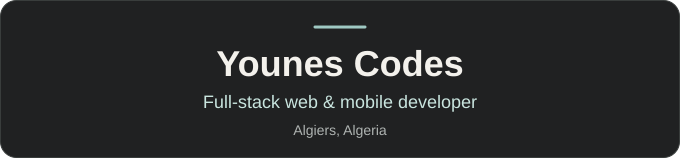
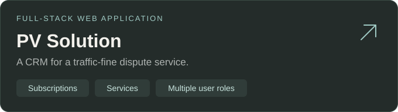

  

  

  
  &nbsp;
  

Open for freelance projects · Remote · Arabic / French / English

### Hello, I'm Younes.

I've been around computers since I was three. Now I build websites and apps for people and businesses, from the interface to the backend.

I'm a computer science student at **USTHB**, working with a French agency and taking on freelance projects. I build full-stack web applications, CRMs, commercial websites, and landing pages for Google Ads campaigns. I'm also building mobile apps with Expo.

I like understanding what I ship, and getting a little better at it every day.

### Featured project

**[PV Solution](https://pv-solution.com/)** is a substantial full-stack CRM web application I built for a traffic-fine dispute service. The project brings together **subscription-based services and multiple user roles**, alongside its public-facing website.

### My toolkit

**Frontend** · JavaScript, React, Next.js, HTML, CSS, Tailwind CSS  
**Backend** · Node.js, Express, NestJS, PostgreSQL, SQL  
**Mobile & deployment** · Expo, Cloudflare, Hostinger VPS

### More client work

- **[The Driver](https://thedriver.fr/)** — A website for a Paris chauffeur service.
- **[Neoforma Conseil](https://neoformaconseil.fr/)** — A website for professional training programmes.
- **[California Sun](https://californiasun.fr/)** — A website for the California Sun salons.
- **[Serrurier Minute](https://serrurier-minute.fr/)** — A landing page for local locksmith services.

### Let's build something together.

Have a website or app in mind? **[Send me an email](mailto:youneskezzim0@gmail.com)** — I'd love to hear about it.
