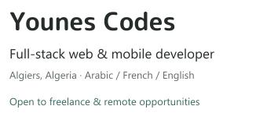
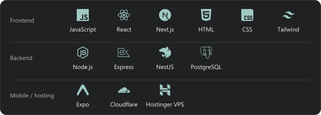

  <picture>
    <source media="(prefers-color-scheme: dark)" srcset="./assets/intro.svg" />
    
  </picture>
  &nbsp;
  

  
  &nbsp;
  

> Building **[Crino](https://crino-agency.vercel.app/en)** — a product studio for web apps, SaaS, and mobile.

Full-stack developer focused on **CRM platforms, subscription-based services, and commercial websites**. Freelance experience since 2023; currently collaborating with a French agency.

### Featured project

**[PV Solution](https://pv-solution.com/)** — Frontend and backend development of a CRM for traffic-fine dispute services, combining **subscriptions, multiple user roles, and a public-facing website**.

### Technical stack

### Selected client work

- **[The Driver](https://thedriver.fr/)** — Commercial website for a Paris chauffeur service.
- **[Neoforma Conseil](https://neoformaconseil.fr/)** — Professional training website, from course discovery to enquiry.
- **[California Sun](https://californiasun.fr/)** — Commercial website for a salon business.
- **[Serrurier Minute](https://serrurier-minute.fr/)** — Lead-generation landing page for local locksmith services.

### Contact

For freelance projects and development opportunities: **[youneskezzim0@gmail.com](mailto:youneskezzim0@gmail.com)**.
