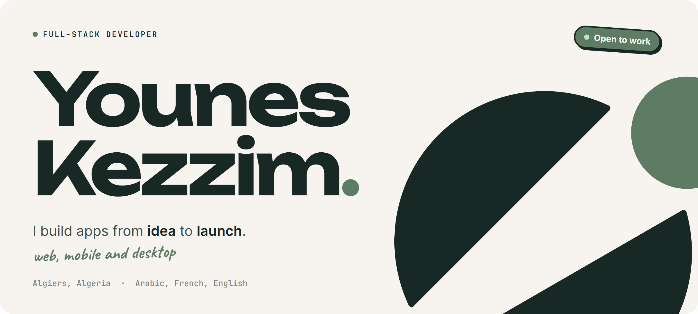
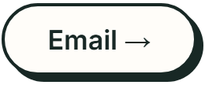
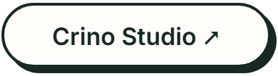
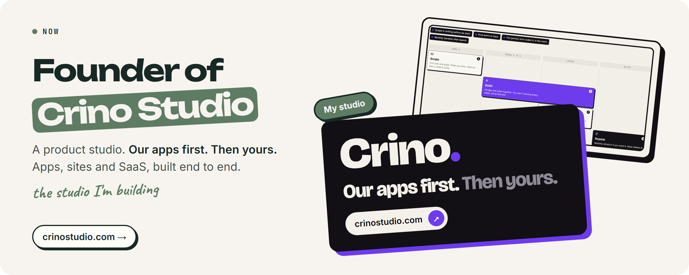
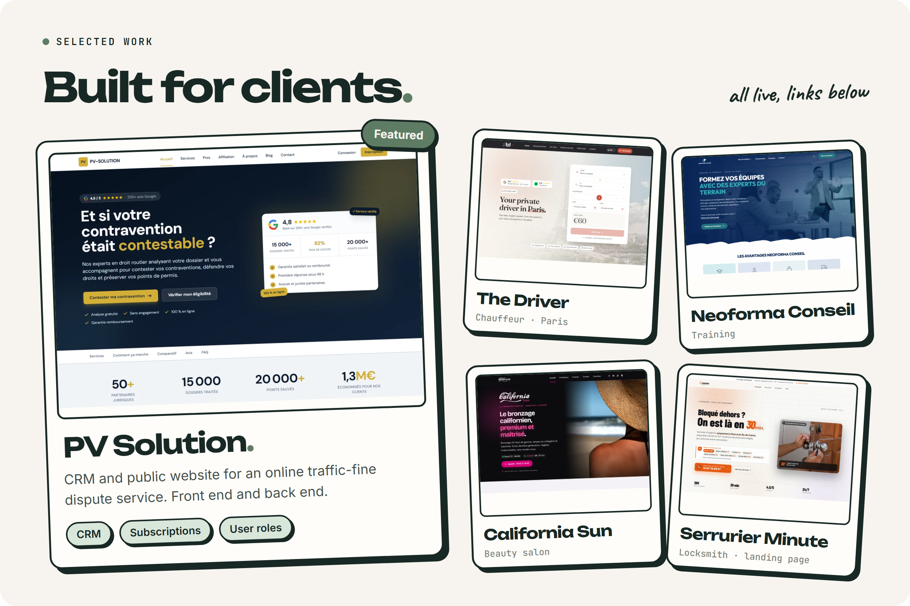
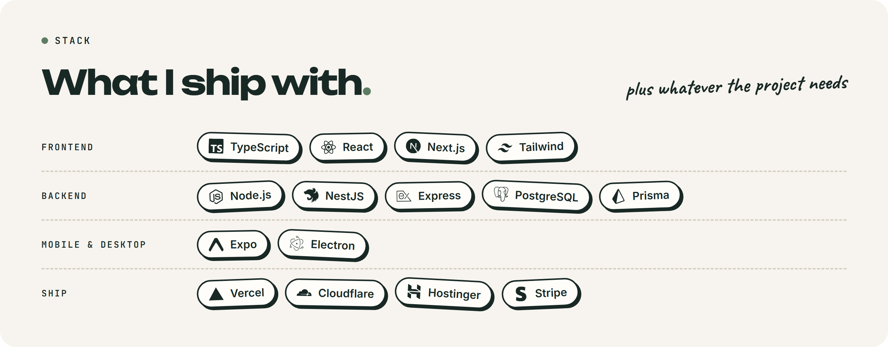
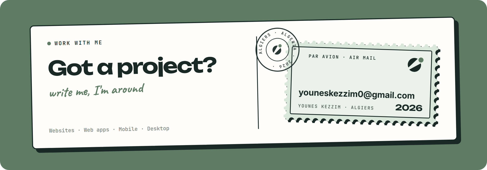

  
  &nbsp;
  
  &nbsp;
  

 

  <a href="https://pv-solution.com/"><b>pv-solution.com</b></a>&nbsp;&nbsp;·&nbsp;&nbsp;<a href="https://thedriver.fr/">thedriver.fr</a>&nbsp;&nbsp;·&nbsp;&nbsp;<a href="https://neoformaconseil.fr/">neoformaconseil.fr</a>&nbsp;&nbsp;·&nbsp;&nbsp;<a href="https://californiasun.fr/">californiasun.fr</a>&nbsp;&nbsp;·&nbsp;&nbsp;<a href="https://serrurier-minute.fr/">serrurier-minute.fr</a>

 

